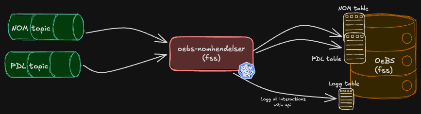

# oebs-nomhendelser

Kafka consumer service that processes employee shielding events from NOM and life events from PDL, and stores them in the OEBS Oracle database.
The service runs in sikker sone (FSS) and consumes two Kafka topics:
- **NOM hendelser** (`nom.skjermede-personer-status-v1`) — status changes for shielded NAV employees
- **Livshendelser** (`pdl.leesah-v1`) — life events from PDL (Folkeregisteret), such as address changes, deaths, and births

---

## Architecture
  
The service acts as a bridge between Kafka (GCP) and the OEBS Oracle database (sikker sone).
Incoming NOM hendelser are consumed as JSON with the employee's national identity number as the Kafka key,
while livshendelser are consumed as Avro (`Personhendelse`) objects.
Both event types are persisted in dedicated tables in the OEBS Oracle database.

Failed events are retried using a configurable backoff-based retry mechanism. Duplicate detection is performed
for both event types before final processing. All events and their processing status are logged to the OEBS database,
including Kafka metadata such as topic, partition, offset, and timestamp.

---

## Functionality

### Instances and environments

The service runs with three instances: t1, q1, and prod.

- **t1** and **q1** run in `dev-fss`, reading topic from pool `nav-dev` in `dev-gcp`
- **prod** runs in `prod-fss`, eading topic from pool `nav-prod` in `prod-gcp`

Deployment order: **t1 → q1 → prod**. Production deployment requires manual trigger via `workflow_dispatch`.

### Kafka topics

| Topic | Format | Description |
|-------|--------|-------------|
| `nom.skjermede-personer-status-v1` | JSON | NOM hendelser — status changes for shielded NAV employees |
| `pdl.leesah-v1` | Avro (`Personhendelse`) | Livshendelser from PDL — life events such as address changes, deaths, and births |

### Event processing

Both event types go through the same processing pipeline:

1. The event is immediately persisted to the database with status `NY` — this ensures database availability is verified before offset commit
2. Duplicate detection is performed; duplicates are marked `DUPLIKAT` and skipped
3. On success the status is updated to `BEHANDLET`
4. On failure the status is set to `RETRY` with a retry timestamp; after all retry attempts are exhausted, status becomes `FEILET`
5. For NOM hendelser under retry: if a newer event for the same person has arrived in the meantime, the event is marked `ERSTATTET`

### Retry mechanism

Failed events are retried automatically via a scheduled job. Retry attempts and backoff intervals are configurable:

| Parameter | Default |
|-----------|---------|
| Max retry attempts | 2880 |
| Backoff period | 60 000 ms (1 minute) |

---

## Dependencies

| System | Purpose |
|--------|---------|
| **OEBS Oracle Database** | Target for all processed event data; stores both NOM hendelser and livshendelser |
| **NOM (nom.skjermede-personer-status-v1)** | Source of shielded-person status events for NAV employees |
| **PDL / Folkeregisteret (pdl.leesah-v1)** | Source of life events (Avro) for persons registered in Folkeregisteret |
| **NAIS platform** | Container orchestration, secrets management, and deployment |

### Consumers
This service is a pure consumer — it does not expose any APIs to other services.

---

## Running Locally

Setup for running locally has not been configured yet, because the service requires
access to kafka topics. The T1 instance can be used for testing. 

---

## Testing

Unit tests are set up using JUnit and Mockito.

---

## Monitoring and Alerting

No alerting is currently configured. Issues must be detected by observing the event processing status in the OEBS database, or through errors reported by teams depending on the data.

Standard application monitoring is available via Grafana dashboards:
- [Grafana dashboard for t1](https://grafana.nav.cloud.nais.io/a/nais-apm-app/services/team-oebs/oebs-nomhendelser-t1?namespace=team-oebs&environment=dev-fss)
- [Grafana dashboard for q1](https://grafana.nav.cloud.nais.io/a/nais-apm-app/services/team-oebs/oebs-nomhendelser-q1?namespace=team-oebs&environment=dev-fss)
- [Grafana dashboard for prod](https://grafana.nav.cloud.nais.io/a/nais-apm-app/services/team-oebs/oebs-nomhendelser?namespace=team-oebs&environment=prod-fss)

---

## Deploy

### Branching strategy
- Feature development should happen on dedicated branches with a PR to `main`.
- Merging to `main` triggers deployment to **T1 and Q1** automatically.
- Deployment to **production** requires a manual workflow dispatch with `deploy_prod: true`.

### Referencing Jira tasks
Include the Jira task key in the branch name and/or commit message. All PRs are squash-merged into main, so the most important thing is that the Jira issue is referenced in the squash commit message and that the PR title references the Jira issue. For example, if working on `OEBS-123`, the commit message should include `feat(OEBS-123): beskrivelse` and the PR title should follow the same format. If a PR covers multiple Jira issues, all should be referenced, e.g. `feat(OEBS-123, OEBS-124): beskrivelse`. All individual commits should be listed in the PR description.

### Promotion criteria
Before deploying to production:
- All tests must pass (`mvn verify`).
- SonarCloud analysis must not introduce new critical issues.

---

## Documentation

### System documentation
No system documentation has been found for this service.
